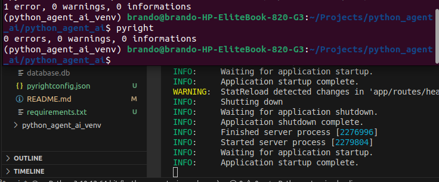

# 🛡️ Chatbot Evaluador de Riesgos Laborales - Backend con FastAPI

Este proyecto es una API RESTful desarrollada con **FastAPI** que simula un **chatbot configurable con roles**, utilizando la API de **OpenAI** y persistencia en **SQLite**.

---

## 🚀 Características Principales

- Registro de usuarios con rol (ej: "experto en riesgos laborales")
- Envío de preguntas a GPT y recepción de respuestas contextualizadas
- Persistencia de interacciones en SQLite
- Consulta de historial por usuario
- Endpoints documentados con Swagger
- Código modular, limpio y con pruebas unitarias
- Validado con **Pyright** para asegurar calidad estática

---

## 📦 Tecnologías Utilizadas

- Python 3.10+
- FastAPI
- SQLModel + SQLite
- OpenAI API (gratuita)
- httpx (cliente HTTP asíncrono)
- dotenv (variables de entorno)
- Pytest (pruebas unitarias)
- Pyright (análisis estático de tipos)

---

## ⚙️ Instalación y Ejecución

### 1. Clona el repositorio

```bash
git clone git@github.com:Brando1998/python_agent_ai.git
```

### 2. Crea y activa un entorno virtual

```bash
python -m venv env
source env/bin/activate  # En Windows: env\Scripts\activate
```

### 3. Instala las dependencias

```bash
pip install -r requirements.txt
```

### 4. Configura el archivo .env

```bash
OPENAI_API_KEY=sk-***************
OPENAI_API_URL=https://api.openai.com/v1/chat/completions
USE_OPENAI_MOCK=false # Simula la api de openai en desarrollo
DATABASE_URL=sqlite:///./app.db
```

### 5. Ejecuta el servidor

```bash
uvicorn app.main:app --reload
```

### 6. Accede a la documentación interactiva

📘 Swagger UI: http://localhost:8000/docs

🔍 Endpoints disponibles

| Método | Ruta                  | Descripción                          |
| ------ | --------------------- | ------------------------------------ |
| POST   | `/init_user`          | Crear usuario con rol personalizado  |
| POST   | `/ask`                | Enviar pregunta al chatbot           |
| GET    | `/history/{username}` | Consultar historial de interacciones |
| GET    | `/health`             | Verificar salud de la API y DB       |


🧪 Pruebas
Ejecutar pruebas unitarias desde la raíz del proyecto ejecutar:

```bash
pytest
```

NOTA: Antes de ejecutar el test es necesario acceder a test_user.py y cambiar la variable username = ""

Incluye pruebas para:

    Creación de usuarios

    Consulta de historial

    Comunicación con el chatbot 

🧰 Validación de tipos con Pyright

Este proyecto es compatible con Pyright para asegurar calidad de tipos estáticos.
Ejecutar Pyright desde la raiz del proyecto

```bash
Pyright
```




📌 Decisiones Técnicas

    SQLModel: facilita el trabajo con SQLite y modelos Pydantic/ORM combinados.

    Modularización: rutas separadas por función (chat, user, health).

    dotenv: permite mantener seguras las claves API fuera del código.

    httpx.AsyncClient: para integrarse bien con FastAPI y aprovechar async/await.

📄 Diagrama de Secuencia

```mermaid
sequenceDiagram
    participant Cliente
    participant API
    participant DB

    Cliente->>API: POST /init_user (username, role)
    API->>DB: Insertar nuevo usuario
    DB-->>API: Usuario creado
    API-->>Cliente: 200 OK + JSON (mensaje, datos)

    Cliente->>API: GET /history/:username
    API->>DB: Buscar historial de usuario
    DB-->>API: Lista vacía
    API-->>Cliente: []

    Cliente->>API: POST /chat
    API->>DB: Buscar usuario
    DB-->>API: Usuario encontrado
    API->>OpenAI: Consultar respuesta
    OpenAI-->>API: Respuesta generada
    API->>DB: Guardar pregunta/respuesta
    API-->>Cliente: Respuesta del chatbot
```



✅ Estado del Proyecto

✔️ Funcional, probado y listo para evaluación.
👨‍💻 Autor

Desarrollado por Brando Diaz Montealegre
[https://www.linkedin.com/in/brando-diaz-montealegre-93b059169/] - [https://github.com/Brando1998]

📸 Ver captura de Pyright en /docs/pyright_ok.png